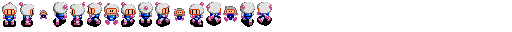

 

  

  <h3 align="center"><strong>Super Bomberman</strong></h3>

  

    Game Project. OOP Project. <a href="https://uet.vnu.edu.vn/"><strong>UET-VNU</strong></a>
     
    <a href="https://github.com/hoangndst/bomb#readme"><strong>Explore the docs</strong></a>
     
    <a href="https://github.com/hoangndst/bomb#readme">View Demo</a>
    ·
    <a href="https://github.com/hoangndst/bomb/issues">Report Bug</a>

  
<strong>Table of Contents</strong>

  <ol>
    <li>
      <a href="#introduction">Introduction</a>
    </li>
    <li>
      <a href="#game-play">Game Play</a>
      <ul>
        <li><a href="#translate-word">Translate Word</a></li>
        <li><a href="#translate-sentence">Translate Sentence</a></li>
        <li><a href="#bookmark">Bookmark</a></li>
      </ul>
    </li>
    <li><a href="#translate-api">Translate API</a></li>
    <li><a href="#database">Database</a></li>
    <li><a href="#libraries">Libraries</a></li>
    <li><a href="#license">License</a></li>
  </ol>

 

## Introduction

Bomberman is a legendary game that has been around for a long time. It is a game where you control a character called a Bomberman and you must destroy all the bombs that are scattered around the map. The bombs are scattered around the map and you must destroy them in order to win the game.

### Bomberman

Bomberman is a character that you control. You can move it around the map and you can use the bombs to destroy all the bombs that are scattered around the map.
### Bomb

- Bomb is a special item that you can use to destroy all the bombs that are scattered around the map.

### Balloom

- Balloom is an enemy that you can destroy to win the game. They move with random direction and they are destroyed by the bombs.

### Bulb

- Bulb is an enemy that you can destroy to win the game. They can find the shortest path to the Bomberman and they are destroyed by the bombs.
- The find path algorithm is A* algorithm.

## How to play
- Movement:
  - WASD
- Place a bomb:
  - Space
- Pause the game:
  - Esc
- Show b2d debug(for developers):
  - B

## Game play

## Libraries
- [Libgdx](https://libgdx.badlogicgames.com/)
- [Gdx-ai](https://github.com/libgdx/gdx-ai)

### Contributor: [@hoangndst](https://github.com/hoangndst), [@naslth](https://github.com/naslth).

## License
[MIT](https://choosealicense.com/licenses/mit/)
